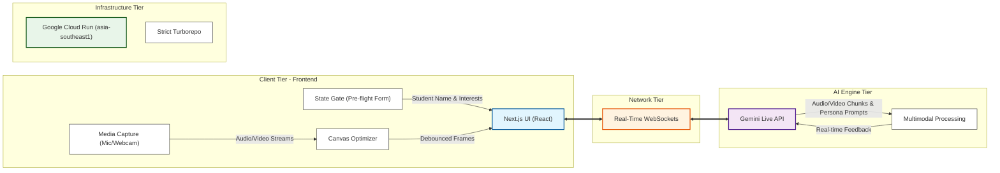

# SgStudyPal: The Curiosity Companion

A next-generation, real-time multimodal AI discovery guide built for the Gemini Live Agent Challenge. It leverages the Gemini Live API over WebSockets to provide a natural, interruptible, vision-and-audio-enabled learning experience.

## Architecture
- **Framework:** Next.js (App Router), Turborepo
- **State Management:** React State-Gating
- **Streaming:** WebSocket Streaming (Gemini Live API)
- **UI & Interaction:** Canvas Optimization



## Spin-Up Instructions (Local Reproducibility)

To run this project locally, execute the following steps:

1. **Install dependencies:**
   ```bash
   npm install
   ```
2. **Configure Environment Variables:**
   Create a `.env.local` file at `/apps/sg-tutor/.env.local` or at the root of the project, and add your Gemini API Key:
   ```env
   GEMINI_API_KEY=YOUR_API_KEY_HERE
   ```
3. **Start the Development Server:**
   ```bash
   npm run dev --filter=sg-tutor
   ```
   *The application should now be accessible at `localhost:3000` (or `localhost:3001` depending on port availability).*

> [!IMPORTANT]
> **Automated Cloud Infrastructure (IaC):** This project includes automated infrastructure-as-code deployment. The included `deploy.sh` script automates the Dockerization of the Next.js standalone build and orchestrates the deployment directly to Google Cloud Run. To deploy, simply replace `YOUR_API_KEY_HERE` in `deploy.sh` with your actual key and run `./deploy.sh`.

## Reproducible Testing Instructions

To evaluate the core Gemini multimodal features of SgStudyPal, please follow these exact steps on the live production environment.

**Live Application URL:** [https://sg-tutor-live-569330575509.asia-southeast1.run.app](https://sg-tutor-live-569330575509.asia-southeast1.run.app)

### Step 1: Authentication
1. Navigate to the Live Application URL.
2. Sign up for a new account (Firebase Auth is fully functional and secure).

### Step 2: Test the Multimodal Homework AI
1. Once logged in, navigate to the **Homework Help** dashboard.
2. Click the upload button and select an image of a math or science problem (e.g., a primary school math worksheet). 
3. *Expected Result:* The image will render in the chat UI. The Gemini 2.5 Flash model will instantly process the image buffer via the Next.js backend, transcribe the question, and begin outputting a step-by-step tutorial without requiring a text prompt.

### Step 3: Test the AI Video Tutor (Gwen)
1. Navigate to the **Video Tutor** section.
2. Initialize the connection. 
3. *Expected Result:* The application will establish a WebSockets connection to Gemini, allowing real-time video/audio tutoring.
