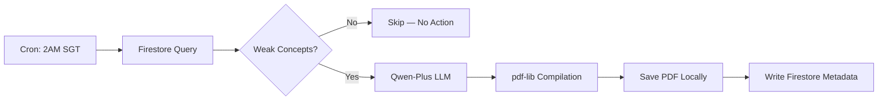

# Incident Log: SG Tutor Phase 4 — Nightly Practice Generator
**Date**: 2026-03-05
**Timestamp**: 18:50:00+08:00
**Milestone**: sg-tutor-phase-4

## Summary

Phase 4 implements a Trigger.dev v3 scheduled task that automatically generates personalized morning practice papers by scanning Firestore for weak concepts, generating exam questions via Qwen-Plus, and compiling them into a PDF.

## Architecture



## Files Created

| File | Purpose |
|---|---|
| `jobs/generate-morning-practice.ts` | Main scheduled task — full pipeline |

## Dependencies Added

| Package | Version | Purpose |
|---|---|---|
| `pdf-lib` | `^1.17.1` | Lightweight PDF generation from text |

## Cron Schedule

- **Expression**: `0 2 * * *` (2:00 AM daily)
- **Timezone**: Singapore (UTC+8), configured via Trigger.dev dashboard
- **Max Duration**: 120 seconds

## LLM Generation Prompt

```
You are a Singapore MOE Primary 6 exam paper setter.
Generate exactly 3 Primary 6 level exam questions targeting these
specific weak concepts: [CONCEPTS].
Rules:
- Each question must be clearly numbered (1, 2, 3).
- Questions should match the Singapore PSLE difficulty level.
- Include a mix of short-answer and structured questions.
- Do NOT include answers or solutions.
- Use plain text formatting only.
```

**Model**: `alibaba("qwen-plus")` — chosen for fast text generation (no vision needed).

## Firestore Schema Additions

### Read: `users/{userId}/sessions`
- Filtered by `mastery_level == "low"` and `timestamp >= 24h ago`
- Deduplicated by concept name

### Write: `users/{userId}/practice_papers`
```
{
  fileName: "morning_practice_2026-03-05.pdf",
  filePath: "/api/papers/morning_practice_2026-03-05.pdf",
  generatedAt: "2026-03-05T02:00:00.000Z",
  weakConcepts: ["fractions", "speed-distance-time"],
  questionCount: 3,
  source: "morning-practice-cron"
}
```

## PDF Layout

- **Library**: `pdf-lib` (zero external dependencies, pure JS)
- **Format**: A4 portrait
- **Features**: Purple branded header, date stamp, word-wrapped question text
- **Fonts**: Helvetica + Helvetica-Bold (StandardFonts — no font file embedding needed)

## Flagged Items

> [!WARNING]
> **Hardcoded `userId`**: Uses `FALLBACK_USER_ID = "guest-p6-student"` — same as all other Phase 3/4 routes.

> [!NOTE]
> **Firebase Admin SDK duplication**: The job file duplicates the Admin SDK init from `lib/firebase-admin.ts` because Trigger.dev workers run in an isolated process and cannot resolve Next.js path aliases (`@/lib/...`).

## Build Verification

```
npm run build -w sg-tutor → EXIT CODE 0
✓ Compiled successfully
✓ Checking validity of types
✓ Generating static pages (12/12)
```

## Next Steps

1. Deploy Trigger.dev project and register the cron schedule.
2. Add frontend "New Practice Available!" alert on the dashboard.
3. Replace `FALLBACK_USER_ID` with real auth across all routes/jobs.
